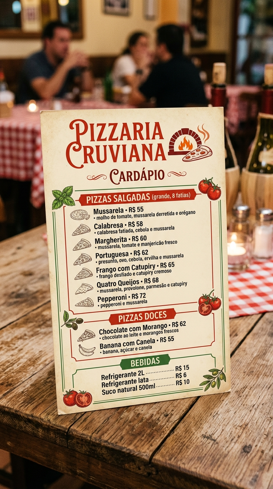
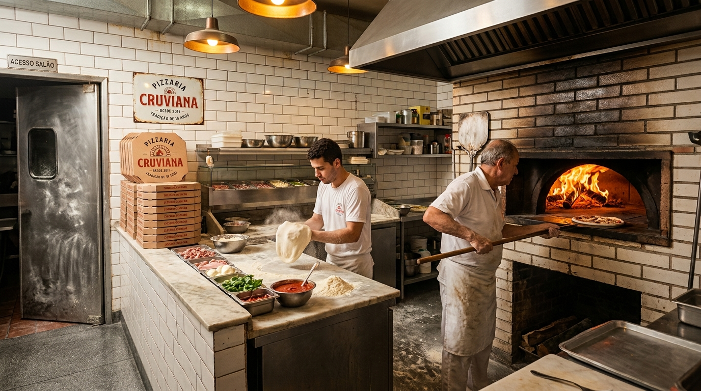
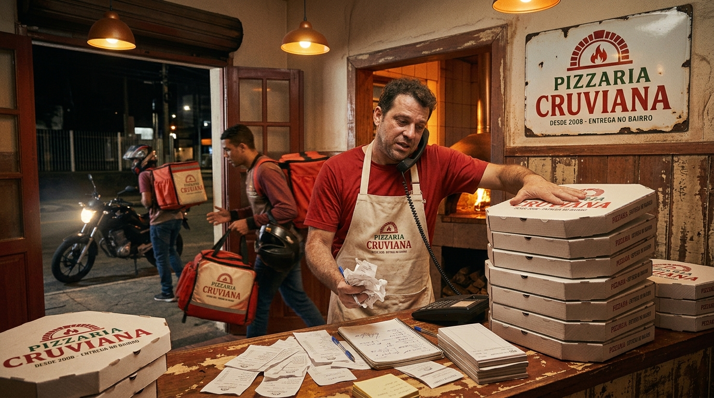
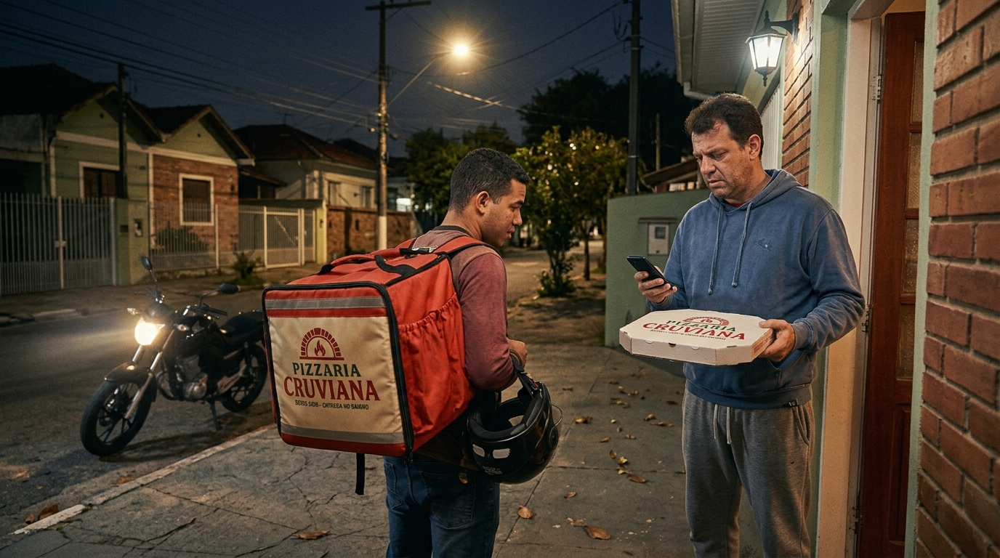

# Desafio de Produto · Pigz

Olá! Este é o desafio técnico de **Análise de Produto** da Pigz. Ele é o mesmo para todos os níveis — a profundidade da sua entrega é o que mostra o seu nível (não precisa dizer qual é).

A gente não te dá um documento de requisitos pronto. A gente te apresenta o problema de um lojista e quer ver o **seu processo de produto inteiro** — do entendimento da dor até um protótipo navegável.

## Sobre usar IA

Pode usar, e a gente recomenda. Trabalhamos com IA aqui o tempo todo. Não estamos medindo se você fez tudo "na mão", e sim se você **conduz a ferramenta, questiona o que ela devolve e sustenta suas decisões**. No fim, conte como usou IA: onde ajudou, onde errou e você corrigiu.

## O cenário: Pizzaria Cruviana

A **Pizzaria Cruviana** é uma pizzaria de bairro, forte no delivery, **aberta desde 2008** — tradição na região, mas o delivery nunca foi profissionalizado. Tocada pela **Dona Vera** e pelo filho **Téo**, que cuida das entregas "no grito".

### Os números (mês passado)
- ~**4.500 pedidos/mês** (~150/dia), ticket médio **R$ 78**; faturamento ~**R$ 350 mil/mês**
- **80% é delivery**; **65% do movimento** entre sexta e domingo, 19h–23h
- Raio de entrega até 6 km; tempo **prometido: 30 min** — no pico **tem passado de 120 min (2 horas)**
- Frota: **5 entregadores próprios** + 2–3 freelas no pico (motos)
- Combustível ~**R$ 7 mil/mês**; avaliação média **3,8★** (reclamação nº 1 = **atraso**; nº 2 = **pizza morna**)
- **Sem roteirização, sem rastreio, sem pesquisa de satisfação** — tudo no olho

### O cardápio

É isso que sai pra entrega — pizzas grandes, uma cozinha a lenha e um ticket médio de R$ 78.

### A operação de entrega (hoje)
- No pico, um entregador sai com 2–4 pizzas e **decide a ordem de cabeça**.
- O **Téo despacha no olho**, sem mapa e sem sistema.
- O cliente **não sabe onde está o pedido** e liga pra pizzaria pra perguntar.
- Depois da entrega, **ninguém pergunta nada** ao cliente.

A cozinha a lenha no pico de uma sexta:

E o despacho, do jeito que funciona hoje — no telefone, na pilha de caixas e nas comandas de papel, sem mapa e sem sistema:

### Téo desabafa (na visita, ele contou:)

> *"Sexta à noite entra pedido pelo telefone, pelo WhatsApp e pelo app, tudo junto. O motoboy sai com três pizzas e decide a ordem no olho — semana passada ele foi na mais longe primeiro e depois voltou pra um prédio que era a duas quadras daqui. Deu quase uma hora numa entrega que era pra ser vinte minutos."*

> *"Eu prometo 30 minutos porque sempre foi assim. Só que no pico a cozinha enche, o motoboy enche, e teve sábado que a pizza saiu e chegou **duas horas** depois. Chegou morna, o cliente reclamou no app, a gente levou **1 estrela** — e eu nem sei em que ponto a coisa travou."*

> *"O telefone não para: 'cadê minha pizza?'. Eu olho pra rua, não sei onde o motoboy está, aí chuto: 'já tá saindo, mais uns quinze minutinhos'. Às vezes é mentira sem querer, porque ele nem pegou o pedido ainda."*

> *"No fim do mês a conta de gasolina vem alta e eu fico sem saber se é porque **vendi mais** ou porque os caras estão **rodando à toa**. Não consigo separar uma coisa da outra."*

> *"Tenho cinco entregadores e não sei te dizer qual é o mais rápido, nem quais bairros sempre atrasam. É tudo na sensação — 'ah, o do Jardim sempre demora' — mas número mesmo eu não tenho."*

> *"Teve dia de sair **duas pizzas pro mesmo prédio em viagens separadas**, com dez minutos de diferença, porque ninguém viu que eram vizinhas. Dois motoboys, duas gasolinas, pro mesmo lugar."*

> *"Quando chove é o caos: todo mundo pede junto, o trânsito trava, atrasa tudo — e eu **não tenho como avisar** o cliente que vai demorar. Ele só descobre quando a pizza não chega."*

> *"Depois que entrega, acabou — **não pergunto nada** pro cliente. Quando a nota cai no app eu vejo, mas aí já era: não sei o que deu errado, nem em qual pedido."*

E é assim que a dor chega até a porta do cliente:

**A dor, em uma frase:** a pizza precisa chegar **quente, em até 30 minutos** — e hoje não chega. Gastar gasolina não é o problema; **gastar sem saber por quê e ainda levar reclamação, é.** Roteirizar, rastrear e medir a satisfação são os meios pra resolver isso.

## A missão

O Téo ouviu falar de um **app de entregador com roteirização e rastreio**, mas não sabe por onde começar. É com você — e a gente quer ver o processo inteiro, nesta ordem:

1. **Requisitos** — entenda a dor, defina as personas (entregador, cliente, Téo/despacho) e **priorize** o que resolve o "30 min quente" agora × o que fica pra depois.
2. **Benchmark** — analise referências de mercado (iFood, Rappi, Loggi, Uber, Waze…) e diga **o que dá pra aprender e o que não se aplica** à Cruviana.
3. **Fluxo de usuário** — mapeie os fluxos: o entregador recebe a rota ordenada; o cliente acompanha em tempo real e vê o ETA; a satisfação é coletada no fim.
4. **Wireframe** — as telas-chave das duas pontas (entregador e cliente). Baixa fidelidade já vale.
5. **Protótipo** — entregue **um protótipo navegável (Figma/afins) _ou_ o front-end** do sistema. Você escolhe, conforme sua praia. Se for pelo front-end, deixamos um **mock de delivery** pronto pra consumir (veja **O back**, abaixo).

E feche com as **métricas de sucesso**: como você saberia que melhorou? (tempo até a porta, % no prazo, combustível por entrega, satisfação/NPS — e como o Téo enfim distinguiria *volume* de *desperdício*).

## O back (opcional — pra quem for de código)

Se você escolher entregar o **front-end** (em vez do protótipo navegável), não precisa montar backend: deixamos um **mock pronto** na pasta [`/mock`](../mock). Ele:

- Lista **pedidos com endereço e coordenadas** e os **entregadores com localização**.
- Empurra, em tempo real (SSE), a **moto se movendo** (`driver.moved`) e as mudanças de pedido — dá pra rastrear a entrega e calcular o ETA.
- Roda **sem instalar nada**, só com Node. Veja o [README do mock](../mock/README.md).

Sinta-se à vontade para ler, ajustar e estender esse mock. **Quem for entregar só o protótipo navegável pode ignorá-lo.**

## O que vamos olhar de perto
- Clareza do problema e das personas; **priorização** que foca no "30 min quente" e corta o resto.
- Benchmark que vira **decisão**, não lista.
- Fluxos que **fecham o ciclo** (entregador + cliente + feedback).
- Wireframe que comunica a intenção.
- Protótipo/front navegável e coerente com os fluxos.
- Métricas ligadas ao problema real.

## Como entregar

Reúna tudo em um só lugar (um documento/deck com requisitos, benchmark, fluxos e wireframes + o link do protótipo navegável ou do repositório do front). Explique suas **decisões e trade-offs** e **como usou IA**. Envie para **desafio@pigz.com.br**.

Se não der tempo de tudo, entregue mesmo assim e conte o que ficou de fora e por quê. Preferimos um recorte bem-feito e bem explicado a tudo pela metade.

## Sobre o tempo

Não cronometramos, mas o desafio foi pensado pra caber num fim de semana sem virar noites. Se você está indo muito além disso, provavelmente está construindo mais do que a gente pediu. Qualquer dúvida sobre o cenário, decida como achar melhor e anote a premissa — interpretar a ambiguidade faz parte.
