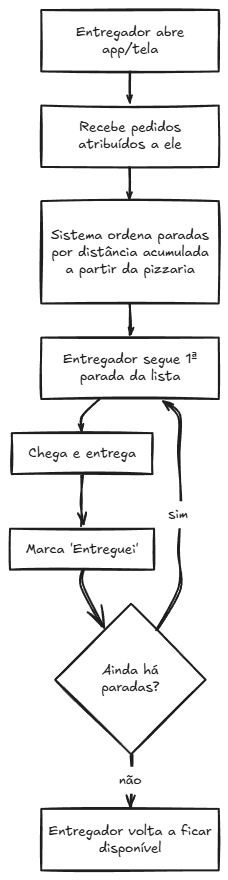

# Análise do Caso Pizzaria Cruviana e Análise de Produto

## Sumário

- [Objetivo e alinhamento](#objetivo-e-alinhamento)
- [1. Requisitos](#1-requisitos)
- [2. Benchmark](#2-benchmark)
- [3. Fluxo de usuário](#3-fluxo-de-usuário)
- [Métricas de sucesso](#métricas-de-sucesso)
- [Como a IA foi usada neste processo](#como-a-ia-foi-usada-neste-processo)
- [Fontes Consultadas](#fontes-consultadas)

## Objetivo e alinhamento

**Objetivo:** entender o caminho do pedido, desde a entrada até a entrega ao cliente, para localizar o fluxo do processo atual empregado na pizzaria.

**Problemática:** a pizza precisa chegar quente em até 30 minutos. Hoje há relatos de entregas que chegam muito depois, mas a operação não consegue identificar em qual etapa o tempo se perde ou as informações não se encontram.

### Avaliação e abordagem escolhida para resolver o problema desse cenário

O MFV (Mapeamento de Fluxo de Valor) é uma abordagem mais adequada ao cenário. Isso porque observa o processo ponta a ponta e inclui tanto o fluxo do pedido/produto quanto o fluxo de informação entre cliente, cozinha, despacho e entregador. Ajuda a diferenciar tempo de trabalho de tempo parado e a tornar visíveis filas, transferências e desperdícios.

### Personas envolvidas

| Persona | Participação no fluxo | Problema observado |
| --- | --- | --- |
| **Cliente** | Faz o pedido, aguarda e recebe a entrega | Não acompanha o pedido, liga para perguntar e não é consultado depois da entrega |
| **Téo — despacho/dono** | Recebe/organiza pedidos e coordena as saídas | Enxerga a operação de forma fragmentada, despacha sem informação consolidada e não sabe onde o atraso aconteceu |
| **Equipe da cozinha** | Prepara os pedidos | Há sobrecarga no pico; sequência, fila e tempos internos ainda precisam ser observados |
| **Entregador** | Retira um ou mais pedidos e realiza as entregas | Decide a ordem de cabeça e pode fazer deslocamentos redundantes |

**Causas-raiz identificadas na entrevista** (mapeadas para compor os requisitos):

1. Pedido chega por 3 canais (telefone/WhatsApp/app) sem fila única visível, **Téo não enxerga o todo.**
2. Roteirização manual e por intuição, ordem de entrega ruim, por dedução totalmente aleatória.
3. Nenhuma visão de pedidos, pode haver duas viagens separadas pro mesmo endereço ou pra mesma localidade.
4. Sem rastreio por parte do cliente, cliente liga, Téo "chuta" o ETA (Estimativa de Tempo de Entrega), às vezes inventa sem querer.
5. Sem SLA visível, ninguém percebe que um pedido está estourando os 30 min, que é o tempo proposto, até o cliente reclamar.
6. Sem dado histórico por entregador/bairro.
7. Sem feedback pós-entrega, nota cai no app (fora do controle), mas ninguém sabe qual pedido/etapa causou.

## 1. Requisitos

### Personas (detalhadas)

- **Téo — Despacho/Dono.** Fica no balcão, atende telefone, olha comandas de papel. Precisa de visão única de todos os pedidos (qualquer canal) e dos entregadores disponíveis, para atribuir com 1 clique e parar de "chutar" prazo pro cliente.
- **Entregador (Beto, Rodrigo, Wesley, Marcão, Paulinho).** Sai de moto com 2–4 pizzas. Precisa de uma lista **ordenada** de paradas (não a lista crua de endereços) e visibilidade do que já entregou.
- **Cliente.** Pediu por telefone, WhatsApp ou app. Quer saber "cadê minha pizza" sem ligar, e ser perguntado "como foi?" no final.

### Requisitos Funcionais (RF)

| # | Requisito | Por quê |
| --- | --- | --- |
| RF1 | Painel único com todos os pedidos ativos e sua etapa atual (Téo) | Acaba com "despacho no olho"; é a base de tudo |
| RF2 | Atribuir um entregador a um pedido pronto | Sem isso não existe despacho digital |
| RF3 | Lista de entregas ordenada por rota para o entregador | Ataca diretamente o caso "foi no mais longe primeiro" |
| RF4 | Rastreio em tempo real do entregador no mapa (cliente) + ETA | Ataca diretamente "cliente liga pra perguntar" |
| RF5 | Alerta visual de risco de estouro do prazo de 30 min | Dá ao Téo o que ele não tem: saber *antes* de estourar |
| RF6 | Pesquisa de satisfação pós-entrega (nota 1–5 + comentário) | Fecha o ciclo; hoje "ninguém pergunta nada" |
| RF7 | Detecção de pedidos para o mesmo endereço/prédio (agrupar) | Ataca "duas viagens pro mesmo lugar" — mesmo que seja só um aviso visual, não roteirização real |
| RF8 | Dashboard de métricas (tempo médio, % no prazo, combustível/entrega, ranking por entregador/bairro) | É como o Téo separa volume de desperdício — crítico pra decisão, mas pode ser simples (contadores) na v1 |
| RF9 | Roteirização real com múltiplas paradas otimizadas (considerando trânsito em tempo real) | Exige motor de rotas/mapas com tráfego — ordenar por distância em linha reta já resolve 80% da dor agora |
| RF10 | Notificação proativa ao cliente (push/SMS) sobre atraso por chuva/pico | Depende de canal de notificação externo; v1 resolve via tela de rastreio que o cliente abre (não um aviso automático) |
| RF11 | App nativo para entregador (iOS/Android) | Web responsiva já atende o MVP; nativo é otimização |
| RF12 | Autenticação/login multiusuário, permissões por papel | Operação é pequena (5 entregadores); MVP pode usar seleção simples de perfil |
| RF13 | Precificação dinâmica / split de pedidos automático entre entregadores | Sofisticação de operação madura, não a dor de hoje |

### Requisitos Não Funcionais (RNF)

| # | Requisito | Por quê |
| --- | --- | --- |
| RNF1 | **Tempo real com baixa latência:** atualização do painel (Téo) e do rastreio (cliente) em poucos segundos após o evento ocorrer | Se a atualização demorar, o painel volta a ser "no olho" e o cliente volta a ligar pra perguntar — anula RF1 e RF4 |
| RNF2 | **Usabilidade em campo:** tela do entregador operável com poucos toques, em celular comum, com fonte grande e boa legibilidade sob sol/luz direta | O entregador usa a tela andando de moto, não sentado numa mesa; se for complicada, ele volta a decidir de cabeça |
| RNF3 | **Disponibilidade no pico:** sistema deve se manter estável durante sexta–domingo, 19h–23h (65% do movimento do mês) | É justamente quando a dor de hoje é mais grave; sistema que cai no pico não resolve nada |
| RNF4 | **Resiliência de conexão:** se o celular do entregador ou o link do cliente cair, o sistema reconecta e sincroniza o estado atual sem perder a entrega em andamento | Conectividade em rua/bairro é instável; perder o estado no meio de uma entrega é pior do que não ter sistema |
| RNF5 | **Simplicidade operacional:** nenhuma tela do MVP deve exigir treinamento além de uma explicação rápida (5–10 min) | Equipe pequena, sem TI dedicado; Téo e os entregadores precisam usar no primeiro dia |
| RNF6 | **Privacidade dos dados do cliente:** telefone, endereço e histórico de pedidos acessíveis só a quem opera o despacho, não expostos publicamente | Dado sensível de cliente de bairro; vazamento quebra a confiança que o negócio depende |
| RNF7 | **Compatibilidade sem instalação:** acessível via navegador comum (Android/iOS), sem exigir loja de aplicativos | Reduz fricção de adoção pelos 5 entregadores e evita depender de atualização de app |
| RNF8 | **Escalabilidade leve:** suportar o volume atual (~150 pedidos/dia, picos simultâneos) sem degradar a experiência | O MVP é dimensionado para a operação de hoje; crescimento relevante do volume pede nova avaliação de capacidade |

## 2. Benchmark

Com relação à Pizzaria Cruviana, ela não precisa de um motor de logística de marketplace (iFood, Rappi, Uber Eats etc.). Precisa de três coisas emprestadas desse mercado, cada uma ligada a uma demanda real:

1. **Acompanhamento do pedido em tempo real** (**iFood/Uber**) — resolve o job do cliente de não precisar ligar perguntando.
2. **Lista de paradas ordenada por rota** (**Loggi/Rappi**) — resolve a questão do entregador de não rodar à toa e decidir a rota de "cabeça".
3. **Avaliação pós-entrega leve** (iFood) — resolve a questão do cliente de dar feedback rápido e a avaliação do Téo de entender o que deu certo ou errado.

**Matriz de comparação com o mercado:**

Para cada referência, qual trabalho ela resolve bem, o que a Cruviana pode aprender e o que não se aplica à sua realidade.

| Referência | O que ela resolve bem | O que aprender (aplica ao Cruviana) |
| --- | --- | --- |
| **iFood** | "Quero saber onde está meu pedido sem ligar" e "quero avaliar rápido depois que recebo" | Tela de rastreio do cliente (mapa + ETA + timeline "preparando → a caminho → entregue"); pedir avaliação em estrelas logo após a entrega, de forma leve e rápida |
| **Rappi** | "Quero que um entregador leve várias entregas numa rota sem desperdício" | Conceito de "um entregador, múltiplas entregas numa rota" com lista ordenada de paradas |
| **Loggi** | "Quero não mandar duas viagens para o mesmo lugar" | Ideia de agrupar entregas próximas numa mesma rota/romaneio para reduzir viagens redundantes |
| **Uber (passageiro)** | "Quero ver meu motorista/entregador se aproximando, em tempo real" | Padrão visual de "ETA que atualiza com o carro se movendo no mapa" — altamente reconhecível e gera confiança |
| **Waze** | "Quero que a rota sugerida seja a mais curta/rápida" | Lógica de "rota mais curta/rápida" como insumo pra ordenar paradas |

> *ETA – Tempo de Estimativa de Entrega.*

## 3. Fluxo de usuário

Os diagramas abaixo representam a sequência do fluxo do processo dos usuários:

**1 — O Entregador recebe a rota ordenada:**

**2 — O Cliente acompanha em tempo real e vê o ETA (Tempo Estimado de Entrega):**

**3 — Pesquisa de satisfação coletada no fim:**

### Wireframe

#### Telas para o Entregador

#### Telas para o Cliente

### Protótipo

Optei por fazer o frontend de rastreio e roteirização de entregas, em React + TypeScript, consumindo o mock `mock/server.js`, para demonstrar o ciclo:

> criação → despacho → rota → rastreio → entrega → feedback → métricas

O protótipo pode ser baixado e testado clonando o repositório no GitHub no link:

**Tela 1**

**Tela 2**

**Tela 3**

**Tela 4**

**Tela 5**

**Tela 6**

### Métricas de sucesso

Sobre as métricas de sucesso, cada métrica abaixo ataca diretamente um ponto da dor relatada: o prazo de 30 minutos, a reclamação nº 1 (atraso) e nº 2 (pizza morna), e a dúvida entre vender mais ou operar pior. Sem medir, qualquer melhoria é opinião; com essas métricas, vira fato verificável a cada semana.

| Métrica | Meta |
| --- | --- |
| Tempo até a porta | De até 120 min no pico para ≤ 30–35 min |
| % de entregas no prazo | ≥ 80% |
| Satisfação (nota média) | De 3,8★ para ≥ 4,3★, com ≥ 50% de taxa de resposta |
| Viagens redundantes ao mesmo endereço | Reduzir até zero |
| Combustível por entrega | Usado para separar volume de desperdício, não como número isolado |

## Como a IA foi usada neste processo

Usei IA como ferramenta de produtividade, especialmente nesses pontos que citarei abaixo:

- Estruturação e redação dos documentos de análise, a partir do cenário e da missão proposta.
- Validação da escolha do MFV (Mapeamento Fluxo de Valor) contra critérios do desafio antes de aplicá-lo, em vez de assumir a metodologia sem checagem.
- Tradução de relatos de entrevista em gaps rastreáveis e em requisitos funcionais/não funcionais com rastreabilidade explícita.

Ainda sobre a IA, ela precisou de intervenção minha em determinados pontos do mapeamento. Além disso, em alguns diagramas e nas wireframes, foi necessário eu realizar ajustes manuais para torná-los mais fiéis ao que foi proposto no desafio.

Sobre a prototipagem do frontend, o uso de IA foi para acelerar a codificação, porém mantendo a revisão e o code review sempre sob minha supervisão, além de estruturar sempre um teste de regressão.

## Fontes Consultadas

- LEAN INSTITUTE BRASIL. Mapeamento de fluxo de valor: o que é e como fazer o VSM? *Blog Lean Institute Brasil*, [s. d.]. Disponível em: <https://www.lean.org.br/blog/15/mapeamento-de-fluxo-de-valor-o-que-e-e-como-fazer-o-vsm?srsltid=AU7gw4WOniD5G-IBBQ4CRkPpDRe1W9BWLycsvCrG6DgBjR9ktEJ5JmzL>. Acesso em: 4 out. 2026.
- IFOOD. Benchmarking: o que é e como fazer no seu restaurante. *Blog Parceiros iFood*, [s. d.]. Disponível em: <https://blog-parceiros.ifood.com.br/benchmarking/>. Acesso em: 4 out. 2026.
- CONSELHO ADMINISTRATIVO DE DEFESA ECONÔMICA (CADE). Documento de Trabalho 03/2026: Benchmarking Delivery. Brasília, DF: CADE, 2026. Disponível em: <https://cdn.cade.gov.br/Portal/centrais-de-conteudo/publicacoes/estudos-economicos/documentos-de-trabalho/2026/Documento%20de%20Trabalho%2003%202026%20-%20Benchmarking%20Delivery.pdf>. Acesso em: 4 out. 2026.
- IFOOD INSTITUCIONAL. Mais entregas iFood. *iFood Institucional*, [s. d.]. Disponível em: <https://institucional.ifood.com.br/entregadores/mais-entregas-ifood/>. Acesso em: 4 out. 2026.
- IFOOD INSTITUCIONAL. Mobilidade urbana e logística de entregas. *iFood Institucional*, [s. d.]. Disponível em: <https://institucional.ifood.com.br/estudos-e-pesquisas/mobilidade-urbana-e-logistica-de-entregas/>. Acesso em: 4 out. 2026.
- LUCRO DA CORRIDA. iFood vs Rappi vs Loggi: qual paga mais? *Blog Lucro da Corrida*, [s. d.]. Disponível em: <https://www.lucrodacorrida.com.br/blog/ifood-vs-rappi-vs-loggi-qual-paga-mais>. Acesso em: 4 out. 2026.
- B2BSTACK. Compare: iFood vs Loggi. *B2B Stack*, [s. d.]. Disponível em: <https://www.b2bstack.com.br/compare/ifood-vs-loggi>. Acesso em: 4 out. 2026.
- TOTVS. Aplicativo de entrega de mercadorias: como escolher o melhor para o seu negócio? *Blog TOTVS*, [s. d.]. Disponível em: <https://www.totvs.com/blog/gestao-varejista/aplicativo-de-entrega-de-mercadorias/>. Acesso em: 4 out. 2026.
